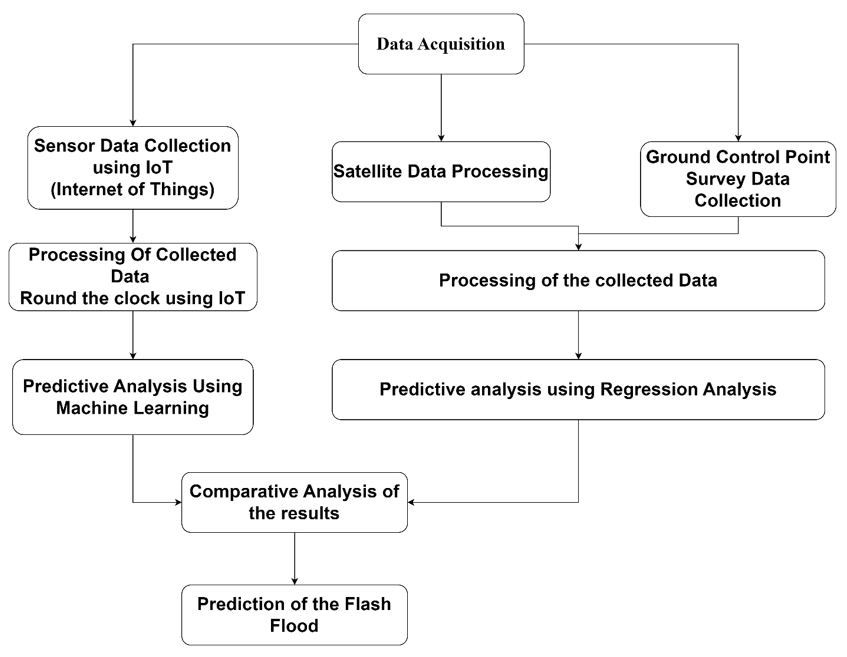

# 🌊 Early Detection of Flash Flood and Landslide using IoT and Machine Learning

A real-time early warning system that uses IoT sensor networks and machine learning to predict flash floods and landslides in high-risk mountainous regions. This project aims to save lives and reduce property damage by issuing timely alerts and enabling informed evacuation decisions.

---

## 📖 Table of Contents

- [Overview](#-overview)
- [System Architecture](#-system-architecture)
- [Key Features](#-key-features)
- [Tech Stack](#-tech-stack)
- [Hardware Components](#-hardware-components)
- [Machine Learning Models](#-machine-learning-models)
- [Folder Structure](#-folder-structure)
- [Installation](#-installation)
- [Usage](#-usage)
- [Limitations](#-limitations)
- [Future Enhancements](#-future-enhancements)
- [Team](#-team)
- [License](#-license)

---

## 🧭 Overview

Flash floods and landslides are sudden and destructive natural disasters, especially prevalent in mountainous terrains such as the Himalayas. Traditional systems fail to provide timely alerts due to lack of real-time data and predictive capability.

This project integrates:
- **IoT-based sensor networks** for environmental monitoring
- **Machine learning models** for real-time prediction
- **Alert mechanisms** (SMS, buzzer, LED indicators) for emergency communication

---

## 🏗️ System Architecture

---

## 🌟 Key Features

- Real-time environmental monitoring
- Flash flood and landslide prediction using ML
- Offline alert triggering with buzzer and LEDs
- SMS alerts via Twilio or GSM module
- Dashboard for real-time visualization and control
- Modular and scalable system architecture

---

## 🧰 Tech Stack

| Component        | Tools Used                                        |
|------------------|---------------------------------------------------|
| Hardware         | ESP32, Arduino, Rain Sensor, Soil Moisture, IMU  |
| Programming      | Python, C++, Arduino IDE                         |
| Machine Learning | Scikit-learn (Random Forest, KNN, Logistic Regression) |
| Cloud/Storage    | Firebase / Google Cloud / Local server           |
| Frontend         | HTML/CSS/JS or React (Optional)                  |
| Alerting         | Twilio API, GSM module, LED, Buzzers             |

---

## 🔩 Hardware Components

| Component               | Purpose                                        |
|-------------------------|------------------------------------------------|
| Soil Moisture Sensor    | Monitor soil saturation to detect landslides   |
| Water Level Sensor      | Detect sudden water level rise (floods)        |
| Rainfall Sensor         | Measure rainfall intensity                     |
| Vibration Sensor        | Detect tremors and slope movements             |
| IMU / Tilt Sensor       | Measure slope angle changes                    |
| ESP32/Arduino           | Data collection and transmission               |
| GSM/LoRa Module         | Remote data communication                      |
| Battery + Solar Panel   | Power in remote areas                          |

---

## 🧠 Machine Learning Models

| Model              | Role                                                |
|--------------------|-----------------------------------------------------|
| Logistic Regression| Basic classification (Safe vs. Danger)             |
| K-Nearest Neighbors| Pattern-based prediction from historical data       |
| Random Forest      | Final classifier with high accuracy and robustness |

### 🔢 Input Features

- Rainfall (current and 24-hour)
- Soil moisture %
- Water level rise (cm/hr)
- Vibration intensity
- Slope angle
- Time of day / seasonality

### 🧪 Evaluation Metrics

- Accuracy, Precision, Recall, F1-Score
- Confusion Matrix
- Feature Importance (from Random Forest)

---

## 📁 Folder Structure

---

## 🚀 Usage

1. **Deploy and power the sensor nodes**  
   - Connect rainfall, soil moisture, vibration, and water level sensors to your ESP32/Arduino board.  
   - Ensure power is supplied via battery or solar panel in field conditions.

2. **Data Transmission**  
   - Sensor readings are collected by the microcontroller.
   - Data is sent to the local server or cloud (depending on connectivity).

3. **Real-Time ML Prediction**  
   - The `run_inference.py` script continuously analyzes incoming data using trained machine learning models.
   - Each data point is classified into one of three risk categories:  
     - `0`: Safe  
     - `1`: Warning  
     - `2`: Critical  

4. **Risk-Based Alerting**  
   - If risk level is `Warning` or `Critical`:
     - 🚨 Buzzer and LEDs are activated for immediate local notification.
     

---

## ⚠️ Limitations

- ⚙️ **Sensor Dependency**  
  Inaccurate or uncalibrated sensors can result in false positives or missed alerts, affecting the reliability of the system.

- 🌐 **Connectivity Issues**  
  LoRa and GSM modules may experience network outages in remote, mountainous areas, causing delays in data transmission and alert delivery.

- 💾 **No Edge ML Yet**  
  Machine learning inference currently depends on a cloud or local server. The absence of on-device (edge) ML limits real-time prediction in offline scenarios.

- 📉 **Thresholds Static**  
  The system currently uses static environmental thresholds. It needs enhancement to support terrain-aware, dynamic thresholding for more accurate predictions.

- 🔐 **Data Security**  
  Sensor data is not encrypted during transmission or storage, posing a risk of interception or tampering in unsecured environments.

- 👥 **No Public Interface**  
  There is no web or mobile interface available for local residents to view risk levels or receive alerts directly.

---

## 🔭 Future Enhancements

- ✅ **Deploy Edge AI Models (e.g., TinyML on ESP32)**  
  Enable real-time inference directly on microcontrollers without relying on cloud connectivity.

- ✅ **Redundant Sensors & LoRa Mesh for Fault Tolerance**  
  Improve system reliability with sensor redundancy and fault-tolerant communication using LoRa mesh networking.

- ✅ **Terrain-Aware Dynamic Thresholding**  
  Implement adaptive thresholds based on terrain type using elevation and satellite data for more accurate predictions.

- ✅ **Admin & Resident Web/Mobile Interfaces**  
  Develop user-friendly dashboards and mobile apps to allow residents and authorities to monitor risk levels and alerts.

- ✅ **Offline Alerts (Buzzer + LED + Local Storage)**  
  Ensure alerts can be delivered even without internet by using hardware indicators and local data buffering.

- ✅ **Live Monitoring Dashboard (Grafana or React-based)**  
  Create a real-time dashboard to visualize sensor data, system health, and alert history for administrators.

- ✅ **Continuous Model Learning via Pipelines (MLflow, Airflow)**  
  Automate the retraining of ML models based on new data to improve predictive performance over time.

- ✅ **Secure Communication with HTTPS/TLS and OAuth-based Access**  
  Implement encryption and role-based access control to ensure data privacy and secure system usage.

---

## 📜 License

This project is licensed under the **MIT License**.  
See the [LICENSE](LICENSE) file for full license details.
